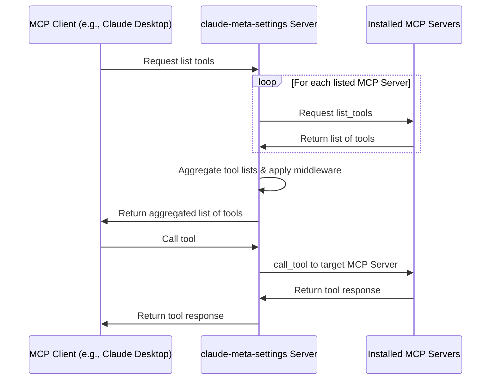

# 🚀 claude-meta-settings (MCP Aggregator, Orchestrator, Middleware, Gateway) <!-- omit in toc -->

<div align="center">

<div align="center">
  <a href="https://opensource.org/licenses/MIT" style="text-decoration: none;">
    
  </a>
</div>

</div>

> **📢 Native distribution:** this fork runs claude-meta-settings **without Docker** (Node + PostgreSQL on the host). See [Quick Start](#-quick-start) and [deploy/native-deployment.md](deploy/native-deployment.md).

**claude-meta-settings** is a MCP proxy that lets you dynamically aggregate MCP servers into a unified MCP server, and apply middlewares. claude-meta-settings itself is a MCP server so it can be easily plugged into **ANY** MCP clients.


---


## 📋 Table of Contents <!-- omit in toc -->

- [🎯 Use Cases](#-use-cases)
- [📖 Concepts](#-concepts)
  - [🖥️ **MCP Server**](#️-mcp-server)
    - [🔐 **Environment Variables \& Secrets (STDIO MCP Servers)**](#-environment-variables--secrets-stdio-mcp-servers)
  - [🏷️ **claude-meta-settings Namespace**](#️-claude-meta-settings-namespace)
  - [🌐 **claude-meta-settings Endpoint**](#-claude-meta-settings-endpoint)
  - [⚙️ **Middleware**](#️-middleware)
  - [🔍 **Inspector**](#-inspector)
  - [✏️ **Tool Overrides \& Annotations**](#️-tool-overrides--annotations)
- [🚀 Quick Start](#-quick-start)
  - [💻 Local Development](#-local-development)
- [🔌 MCP Protocol Compatibility](#-mcp-protocol-compatibility)
- [🔗 Connect to claude-meta-settings](#-connect-to-claude-meta-settings)
  - [📝 E.g., Cursor via mcp.json](#-eg-cursor-via-mcpjson)
  - [🖥️ Connecting Claude Desktop and Other STDIO-only Clients](#️-connecting-claude-desktop-and-other-stdio-only-clients)
  - [🔧 API Key Auth Troubleshooting](#-api-key-auth-troubleshooting)
- [❄️ Cold Start Behavior](#️-cold-start-behavior)
- [🧾 Log Levels](#-log-levels)
- [🔐 Authentication](#-authentication)
- [🚦 Traffic Management](#-traffic-management)
  - [🚧 **MCP Rate Limit**](#-mcp-rate-limit)
- [🔗 OpenID Connect (OIDC) Provider Support](#-openid-connect-oidc-provider-support)
  - [🛠️ **Configuration**](#️-configuration)
  - [🏢 **Supported Providers**](#-supported-providers)
  - [🔒 **Security Features**](#-security-features)
  - [📱 **Usage**](#-usage)
- [⚙️ Registration Controls](#️-registration-controls)
  - [🎛️ **Available Controls**](#️-available-controls)
  - [🏢 **Enterprise Use Cases**](#-enterprise-use-cases)
  - [🛠️ **Configuration**](#️-configuration-1)
- [🌐 Custom Deployment and SSE conf for Nginx](#-custom-deployment-and-sse-conf-for-nginx)
- [🏗️ Architecture](#️-architecture)
  - [📊 Sequence Diagram](#-sequence-diagram)
- [🗺️ Roadmap](#️-roadmap)
- [🌐 i18n](#-i18n)
- [🤝 Contributing](#-contributing)
- [📄 License](#-license)
- [🙏 Credits](#-credits)

## 🎯 Use Cases
- 🏷️ **Group MCP servers into namespaces, host them as meta-MCPs, and assign public endpoints** (SSE or Streamable HTTP), with auth. One-click to switch a namespace for an endpoint.
-  🎯 **Pick tools you only need when remixing MCP servers.** Apply other **pluggable middleware** around observability, security, etc. (coming soon)
-  🔍 **Use as enhanced MCP inspector** with saved server configs, and inspect your claude-meta-settings endpoints in house to see if it works or not.
-  🔍 **Use as Elasticsearch for MCP tool selection** (coming soon)

Generally developers can use claude-meta-settings as **infrastructure** to host dynamically composed MCP servers through a unified endpoint, and build agents on top of it.

Quick demo video: https://youtu.be/Cf6jVd2saAs


## 📖 Concepts

### 🖥️ **MCP Server**
A MCP server configuration that tells claude-meta-settings how to start a MCP server.

```json
"HackerNews": {
  "type": "STDIO",
  "command": "uvx",
  "args": ["mcp-hn"]
}
```

#### 🔐 **Environment Variables & Secrets (STDIO MCP Servers)**

For **STDIO MCP servers**, claude-meta-settings supports three ways to handle environment variables and secrets:

**1. Raw Values** - Direct string values (not recommended for secrets):
```
API_KEY=your-actual-api-key-here
DEBUG=true
```

**2. Environment Variable References** - Use `${ENV_VAR_NAME}` syntax:
```
API_KEY=${OPENAI_API_KEY}
DATABASE_URL=${DB_CONNECTION_STRING}
```

**3. Auto-matching** - If the expected environment variable name in your tool matches the container's environment variable, you can omit it entirely. claude-meta-settings will automatically pass through matching environment variables.

> **🔒 Security Note**: Environment variable references (`${VAR_NAME}`) are resolved from the claude-meta-settings container's environment at runtime. This keeps actual secret values out of your configuration and git repository.

> **⚙️ Development Note**: For local development with `pnpm dev`, ensure your environment variables are listed in `turbo.json` under `globalEnv` so they are passed through to the dev processes.

### 🏷️ **claude-meta-settings Namespace**
- Group one or more MCP servers into a namespace
- Enable/disable MCP servers or at tool level
- Apply middlewares to MCP requests and responses
- Override tool names/titles/descriptions per namespace and attach custom MCP annotations (e.g. `{ "annotations": { "readOnlyHint": false } }`)

### 🌐 **claude-meta-settings Endpoint**
- Create endpoints and assign namespace to endpoints
- Multiple MCP servers in the namespace will be aggregated and emitted as a claude-meta-settings endpoint
- Choose between API-Key Auth (in header or query param) or standard OAuth in MCP Spec 2025-06-18
- Host through **SSE** or **Streamable HTTP** transports in MCP and **OpenAPI** endpoints for clients like [Open WebUI](https://github.com/open-webui/open-webui)

### ⚙️ **Middleware**
- Intercepts and transforms MCP requests and responses at namespace level
- **Built-in example**: "Filter inactive tools" - optimizes tool context for LLMs
- **Future ideas**: tool logging, error traces, validation, scanning

### 🔍 **Inspector**
Similar to the official MCP inspector, but with **saved server configs** - claude-meta-settings automatically creates configurations so you can debug claude-meta-settings endpoints immediately.

### ✏️ **Tool Overrides & Annotations**
- Open a namespace → **Tools** tab to see every tool coming from connected MCP servers.
- Each saved tool can be expanded and edited inline: update the display **name/title/description** or provide a JSON blob with namespace-specific annotations (for example `{ "annotations": { "readOnlyHint": false } }`).
- Badges in the table ("Overridden", "Annotations") show which tools currently have custom metadata. Hover them to read a tooltip describing what was overridden.
- Annotation overrides are merged with whatever the upstream MCP server returns, so you can safely add custom UI hints without losing provider metadata.

## 🚀 Quick Start

claude-meta-settings runs as **two Node processes plus PostgreSQL** — no Docker required.

**Prerequisites:** Node.js 20+, pnpm 9, PostgreSQL 16.

```bash
git clone https://github.com/Kirchlive/claude-meta-settings.git
cd claude-meta-settings
pnpm install --frozen-lockfile
sh scripts/patch-next-proxy-timeout.sh                 # bump Next.js proxy timeout for long MCP calls
cp example.env .env                                    # set DATABASE_URL, BETTER_AUTH_SECRET, APP_URL,
                                                       # NEXT_PUBLIC_APP_URL; TRANSFORM_LOCALHOST_TO_DOCKER_INTERNAL=false
NEXT_PUBLIC_APP_URL="http://localhost:12008" pnpm build
cd apps/backend && pnpm exec drizzle-kit migrate && cd -   # create the DB/role first
PORT=12009 node apps/backend/dist/index.js &           # backend
PORT=12008 pnpm --filter frontend start                # frontend → http://localhost:12008
```

See **[deploy/native-deployment.md](deploy/native-deployment.md)** for the full guide — env vars (build-time vs runtime), process managers (systemd/launchd/pm2), nginx, and migrating an existing Docker deployment.

If you modify `APP_URL`, access claude-meta-settings only from that URL — claude-meta-settings enforces a CORS policy against it, so no other URL is accessible.

### **💻 Local Development**

```bash
pnpm install
pnpm dev
```

`pnpm dev` runs the frontend (:12008) and backend (:12009) in watch mode. You need a PostgreSQL 16 instance reachable via `DATABASE_URL` in your `.env`.

## 🔌 MCP Protocol Compatibility

- ✅ **Tools, Resources, and Prompts** supported
- ✅ **OAuth-enabled MCP servers** tested for 03-26 version

If you have questions, feel free to leave **GitHub issues** or **PRs**.

## 🔗 Connect to claude-meta-settings

### 📝 E.g., Cursor via mcp.json

Example `mcp.json`

```json
{
  "mcpServers": {
    "claude-meta-settings": {
      "url": "http://localhost:12008/metamcp/<YOUR_ENDPOINT_NAME>/sse"
    }
  }
}
```

### 🖥️ Connecting Claude Desktop and Other STDIO-only Clients

Since claude-meta-settings endpoints are remote only (SSE, Streamable HTTP, OpenAPI), clients that only support stdio servers (like Claude Desktop) need a local proxy to connect.

**Note:** While `mcp-remote` is sometimes suggested for this purpose, it's designed for OAuth-based authentication and doesn't work with claude-meta-settings's API key authentication. Based on testing, `mcp-proxy` is the recommended solution.

Here's a working configuration for Claude Desktop using `mcp-proxy`:

Using Streamable HTTP

```json
{
  "mcpServers": {
    "claude-meta-settings": {
      "command": "uvx",
      "args": [
        "mcp-proxy",
        "--transport",
        "streamablehttp",
        "http://localhost:12008/metamcp/<YOUR_ENDPOINT_NAME>/mcp"
      ],
      "env": {
        "API_ACCESS_TOKEN": "<YOUR_API_KEY_HERE>"
      }
    }
  }
}
```

Using SSE

```json
{
  "mcpServers": {
    "ehn": {
      "command": "uvx",
      "args": [
        "mcp-proxy",
        "http://localhost:12008/metamcp/<YOUR_ENDPOINT_NAME>/sse"
      ],
      "env": {
        "API_ACCESS_TOKEN": "<YOUR_API_KEY_HERE>"
      }
    }
  }
}
```

**Important notes:**
- Replace `<YOUR_ENDPOINT_NAME>` with your actual endpoint name
- Replace `<YOUR_API_KEY_HERE>` with your claude-meta-settings API key (format: `sk_mt_...`)

For more details and alternative approaches, see [issue #76](https://github.com/Kirchlive/claude-meta-settings/issues/76#issuecomment-3046707532).

### 🔧 API Key Auth Troubleshooting

- `?api_key=` param api key auth doesn't work for SSE. It only works for Streamable HTTP and OpenAPI.
- Best practice is to use the API key in `Authorization: Bearer <API_KEY>` header.
- Try disable auth temporarily when you face connection issues to see if it is an auth issue.

## ❄️ Cold Start Behavior

- claude-meta-settings pre-allocates idle sessions for each configured MCP server and claude-meta-settings. The default is 1 idle session each, which helps reduce cold-start time.
- STDIO MCP servers spawn as child processes of the backend, so their runtime dependencies (`uvx`, `npx`, `node`, …) must be available on the host `PATH`. Install whatever your servers need on the host.

## 🧾 Log Levels

claude-meta-settings’s backend writes logs to files and optionally mirrors selected levels to the console. Control console mirroring with the `LOG_LEVEL` environment variable.

- Files
  - `app.log`: receives `DEBUG`, `INFO`, and `WARN`
  - `error.log`: receives `ERROR`

- Console mirroring (`LOG_LEVEL`)
  - `all`: mirror `DEBUG`, `INFO`, `WARN`, `ERROR` to console
  - `info`: mirror only `INFO` to console
  - `errors-only`: mirror `WARN` and `ERROR` to console
  - `none`: no console output

- Defaults and examples
  - Default (when unset or invalid): `errors-only`
  - `.env` example:
    ```bash
    LOG_LEVEL='errors-only' # 'all', 'info', 'errors-only', 'none'
    ```

## 🔐 Authentication

- 🛡️ **Better Auth** for frontend & backend (TRPC procedures)
- 🍪 **Session cookies** enforce secure internal MCP proxy connections
- 🔑 **API key authentication** for external access via `Authorization: Bearer <api-key>` header
- 🪪 **MCP OAuth**: Exposed endpoints have options to use standard OAuth in MCP Spec 2025-06-18, easy to connect.
- 🏢 **Multi-tenancy**: Designed for organizations to deploy on their own machines. Supports both private and public access scopes. Users can create MCPs, namespaces, endpoints, and API keys for themselves or for everyone. Public API keys cannot access private claude-meta-settings instances.
- ⚙️ **Separate Registration Controls**: Administrators can independently control UI registration and SSO/OAuth registration through the settings page, allowing for flexible enterprise deployment scenarios.

## 🚦 Traffic Management

### 🚧 MCP Rate Limit
The MCP Rate Limit feature allows you to set the maximum requests a MCP tool (a endpoint) will accept in a given time window. There are two different strategies to set limits that you can use separately or together:

 * `Endpoint rate-limiting (Rate Limiting)`: applies simultaneously to all clients using the endpoint, sharing a unique counter.
 * `User rate-limiting (Client Rate Limiting)`: sets a counter to each individual user.

Both types can coexist and they complement each other, and store the counters in-memory. On a cluster, each machine sees and counts only its passing traffic.

### **Endpoint rate-limiting**
The endpoint rate limit acts on the number of simultaneous transactions an endpoint can process. This type of limit protects the service for all customers.
When the users connected to an endpoint together exceed the `rate-limiting`, claude-meta-settings starts to reject connections with a status code `503 Service Unavailable`.

#### **Endpoint rate-limiting options**
 * `Max Rate`: Defines how many requests will you accept from all users together at any given instant. When the gateway starts, the bucket is full. As requests from users come, the remaining tokens in the bucket decrease. At the same time, the rate-limiting refills the bucket at the desired rate until its maximum capacity is reached.
 * `Max Rate Seconds`: Time period in which the maximum rates operate in seconds. For instance, if you set an max rate seconds of 60s and a rate-limiting of 5, you are allowing 5 requests every sixty seconds.

### **User rate-limiting**
The client or user rate limit applies one counter to each individual user and endpoint. When a single user connected to an endpoint exceeds their `client-max-rate`, claude-meta-settings starts rejecting connections with a status code `429 Too Many Requests`

#### **User rate-limiting options**
 * `Client Max Rate`: Number of tokens you add to the Token Bucket for each individual user (user quota) in the time interval you want (Client Max Rate Seconds). The remaining tokens in the bucket are the requests a specific user can do.
 * `Client Max Rate Seconds`: Time period in which the maximum rates operate in seconds. For instance, if you set an every of 60s and a rate of 5, you are allowing 5 requests every sixty seconds.
 * `Client Max Rate Strategy`: Sets the strategy you will use to set client counters. Choose ip when the restrictions apply to the client’s IP address, or set it to header when there is a header that identifies a user uniquely. That header must be defined with the key entry.
 * `Client Max Rate Strategy Key`: It is the header name containing the user identification (e.g., Authorization on tokens, or X-Original-Forwarded-For for IPs).

## 🔗 OpenID Connect (OIDC) Provider Support

claude-meta-settings supports **OpenID Connect authentication** for enterprise SSO integration. This allows organizations to use their existing identity providers (Auth0, Keycloak, Azure AD, etc.) for authentication.

### 🛠️ **Configuration**

Add the following environment variables to your `.env` file:

```bash
# Required
OIDC_CLIENT_ID=your-oidc-client-id
OIDC_CLIENT_SECRET=your-oidc-client-secret
OIDC_DISCOVERY_URL=https://your-provider.com/.well-known/openid-configuration

# Optional customization
OIDC_PROVIDER_ID=oidc
OIDC_SCOPES=openid email profile
OIDC_PKCE=true
```

### 🏢 **Supported Providers**

claude-meta-settings has been tested with popular OIDC providers:

- **Auth0**: `https://your-domain.auth0.com/.well-known/openid-configuration`
- **Keycloak**: `https://your-keycloak.com/realms/your-realm/.well-known/openid-configuration`
- **Azure AD**: `https://login.microsoftonline.com/your-tenant-id/v2.0/.well-known/openid-configuration`
- **Google**: `https://accounts.google.com/.well-known/openid-configuration`
- **Okta**: `https://your-domain.okta.com/.well-known/openid-configuration`

### 🔒 **Security Features**

- 🔐 **PKCE (Proof Key for Code Exchange)** enabled by default
- 🛡️ **Authorization Code Flow** with automatic user creation
- 🔄 **Auto-discovery** of OIDC endpoints
- 🍪 **Seamless session management** with existing auth system

### 📱 **Usage**

Once configured, users will see a **"Sign in with OIDC"** button on the login page alongside the email/password form. The authentication flow automatically creates new users on first login.

For more detailed configuration examples and troubleshooting, see **[CONTRIBUTING.md](CONTRIBUTING.md#openid-connect-oidc-provider-setup)**.

## ⚙️ Registration Controls

claude-meta-settings provides **separate controls** for different registration methods, allowing administrators to fine-tune user access policies for enterprise deployments.

### 🎛️ **Available Controls**

- **UI Registration**: Controls whether users can create accounts via the registration form
- **SSO Registration**: Controls whether users can create accounts via SSO/OAuth providers (OIDC, etc.)

### 🏢 **Enterprise Use Cases**

This separation enables common enterprise scenarios:

- **Block UI registration, allow SSO**: Prevent manual signups while allowing corporate SSO users
- **Block SSO registration, allow UI**: Allow manual signups while restricting SSO access
- **Block both**: Completely disable new user registration
- **Allow both**: Default behavior for open deployments

### 🛠️ **Configuration**

Access the **Settings** page in the claude-meta-settings admin interface to configure these controls:

1. Navigate to **Settings** → **Authentication Settings**
2. Toggle **"Disable UI Registration"** to control form-based signups
3. Toggle **"Disable SSO Registration"** to control OAuth/OIDC signups

Both controls work independently, giving you full flexibility over your registration policy.

## 🌐 Custom Deployment and SSE conf for Nginx

If you want to deploy it to a online service or a VPS, a instance of at least 2GB-4GB of memory is required. And the larger size, the better performance.

Since MCP leverages SSE for long connections, if you use a reverse proxy like nginx, see the example server block at [deploy/nginx-metamcp.conf](deploy/nginx-metamcp.conf).

## 🏗️ Architecture

- **Frontend**: Next.js
- **Backend**: Express.js with tRPC, hosting MCPs through TS SDK and internal proxy
- **Auth**: Better Auth
- **Structure**: Standalone monorepo with Turborepo

### 📊 Sequence Diagram

*Note: Prompts and resources follow similar patterns to tools.*



## 🗺️ Roadmap

**Potential next steps:**

- [ ] 🔌 Headless Admin API access
- [ ] 🔍 Dynamically apply search rules on claude-meta-settings endpoints
- [ ] 🛠️ More middlewares
- [ ] 💬 Chat/Agent Playground
- [ ] 🧪 Testing & Evaluation for MCP tool selection optimization
- [ ] ⚡ Dynamically generate MCP servers

## 🌐 i18n

The dashboard UI ships English and Chinese (zh) locales.

## 🤝 Contributing

We welcome contributions! See details at **[CONTRIBUTING.md](CONTRIBUTING.md)**

## 📄 License

**MIT**

Would appreciate if you mentioned with back links if your projects use the code.

## 🙏 Credits

Some code inspired by:
- [MCP Inspector](https://github.com/modelcontextprotocol/inspector)
- [MCP Proxy Server](https://github.com/adamwattis/mcp-proxy-server)

Not directly used the code by took ideas from
- https://github.com/open-webui/openapi-servers
- https://github.com/open-webui/mcpo
